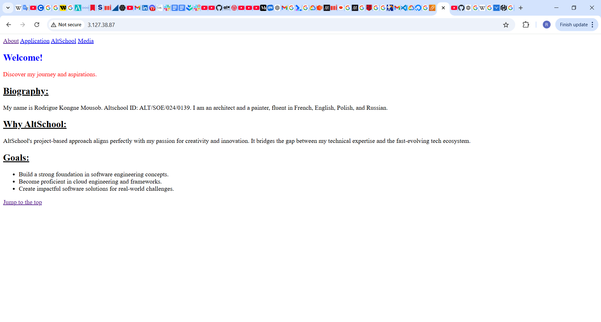

# ip : 3.127.38.87
# name : Rodrigue Kongne 
# altschool : ALT/SOE/024/0139
# My project
Here's a screenshot of my project 


# Server Setup and Deployment Documentation

This documentation provides a summary of how I set up a Linux server, installed an Nginx web server, deployed an HTML page, and configured networking to make the page publicly accessible.

---

## 1. Provisioning the Server

### Steps:
1. Logged into AWS and launched an EC2 instance with **Ubuntu 22.04 LTS**.
2. Selected a **t2.micro** instance type.
3. Configured the security group to allow SSH (port 22) and HTTP (port 80).
4. Connected to the instance using SSH:
   ```bash
   ssh -i your-key.pem ubuntu@your-public-ip
   ```

---

## 2. Web Server Setup

### Steps:
1. Updated the system:
   ```bash
   sudo apt update && sudo apt upgrade -y
   ```
2. Installed Nginx:
   ```bash
   sudo apt install nginx -y
   ```
3. Started and enabled Nginx:
   ```bash
   sudo systemctl start nginx
   ```
4. Verified the installation by accessing the public IP in a browser.

---

## 3. HTML Page Deployment

### Steps:
1. Navigated to the Nginx document root:
   ```bash
   cd /var/www/html
   ```
2. Created an HTML file:
   ```bash
   sudo nano index.html
   ```
3. Added the following content:
   ```html
   <!DOCTYPE html>
   <html lang="en">
   <head>
       <meta charset="UTF-8">
       <meta name="viewport" content="width=device-width, initial-scale=1.0">
       <title>Welcome to My Landing Page</title>
   </head>
   <body>
       <h1>Welcome to My Landing Page</h1>
       <p>Hi, I'm [Your Name]. This page is deployed on an Nginx web server.</p>
       <h2>About Me</h2>
       <p>[Include a short bio and interesting details about yourself]</p>
   </body>
   </html>
   ```
4. Saved and ensured proper permissions:
   ```bash
   sudo chown www-data:www-data /var/www/html/index.html
   sudo chmod 644 /var/www/html/index.html
   ```
5. Tested by accessing the page via the server's public IP.

---

## 4. Networking Configuration

### Steps:
1. Verified that the security group allowed HTTP traffic (port 80) in AWS.
2. Accessed the page using the server's public IP in a browser:
   ```
   http://your-public-ip
   ```

---

## Conclusion

I successfully:
- Provisioned an Ubuntu server on AWS.
- Installed and configured Nginx.
- Deployed a custom HTML landing page.
- Configured networking for public access.

Enjoy browsing the page!
